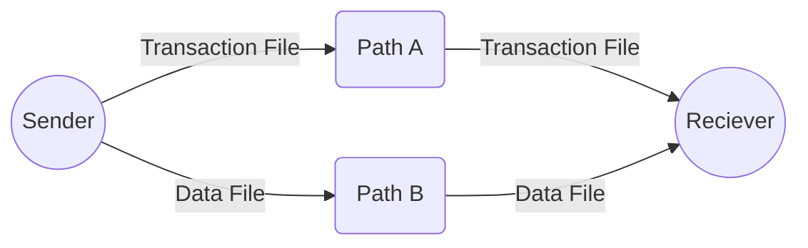

# CryptoGen

download the core setup program and run it from from powershell
```

.\install-CryptoGen.ps1

```
CryptoGen includes tools that can be chosen from the core installer.

## AgentKIF

* AgentKIF allows for the transfer of offline data using a blockchain transaction file and a separate data file, both of which can be copied independently.

* Setup on windows
&emsp;https://github.com/CryptoGenY/CryptoGen/tree/main/AgentKIF.setup.md

* Help
&emsp;https://github.com/CryptoGenY/CryptoGen/tree/main/AgentKIF.help.md
  


