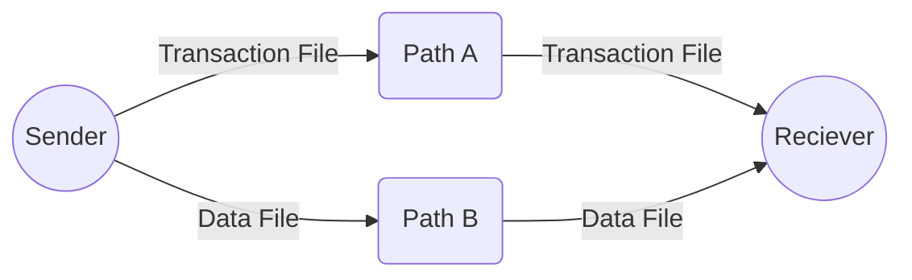

## CryptoGen

# AgentKIF

* Setup on windows
https://github.com/CryptoGenY/CryptoGen/tree/main/AgentKIF.setup.md

* Help
https://github.com/CryptoGenY/CryptoGen/tree/main/AgentKIF.help.md

* AgentKIF allows for the transfer of offline data using a blockchain transaction file and a separate data file, both of which can be copied independently.

  

